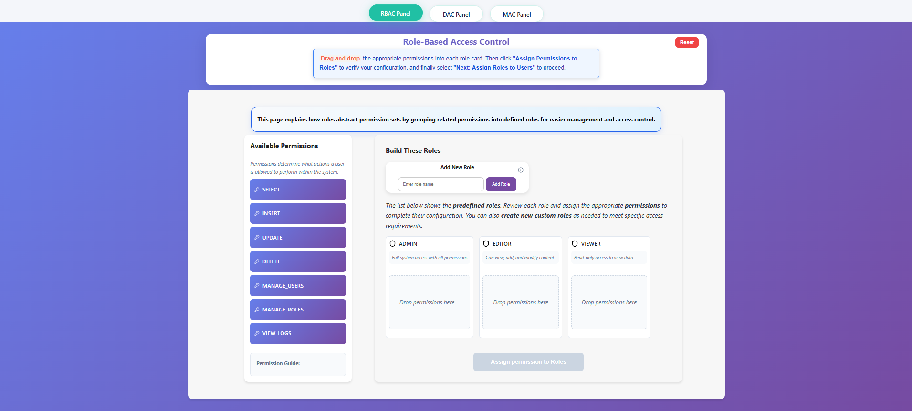

#### Step 1 — Start With RBAC

First, learn the Role-Based Access Control (RBAC) system.

**Click on the RBAC Panel at the top .**
 
####  Step 1.1 — Build Roles

- Read the instructions at the top and **drag and drop** the correct permissions into each role.  
  

- Click **Assign Permissions to Roles** to validate your setup.  
  A green **Assigned** status indicates a successful configuration.  
- Then click **Next: Assign Roles to Users** to continue.  
  

####  Step 1.2 — Assign Roles to Users

- Assign the available roles to users based on their **positions and responsibilities**.  
  

- Click **Verify User Roles** to confirm your assignments, then select **Next: Testing Phase** to proceed.  
  

####  Step 1.3 — Test & Verify Privileges

- In the Testing Phase, **select a user** from the left panel, choose an **action**, and test whether that user has access to perform it.  
  

- Click **Test Access** and observe the result:  
  -  **Access Granted** — The user’s role includes the required permission.  
  -  **Access Denied** — The user’s role does not include the required permission.  

- Review the **Access Log** for details such as the user, assigned role, action, and timestamp.  
  

