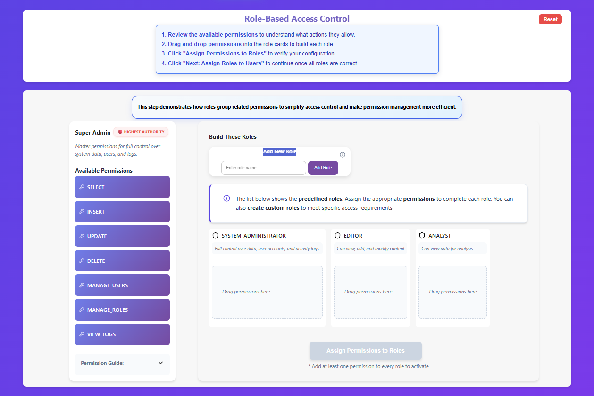
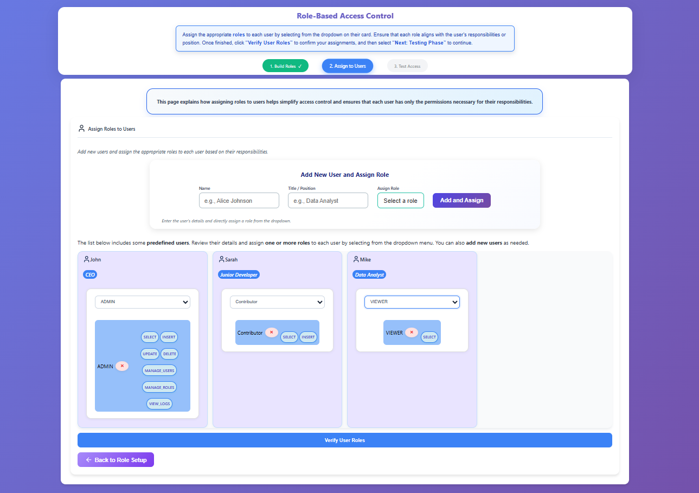
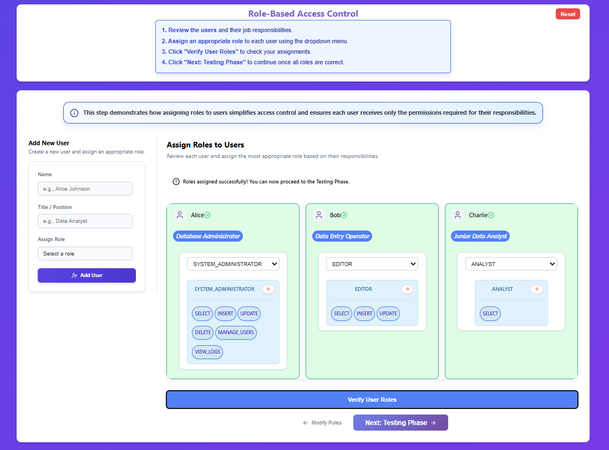
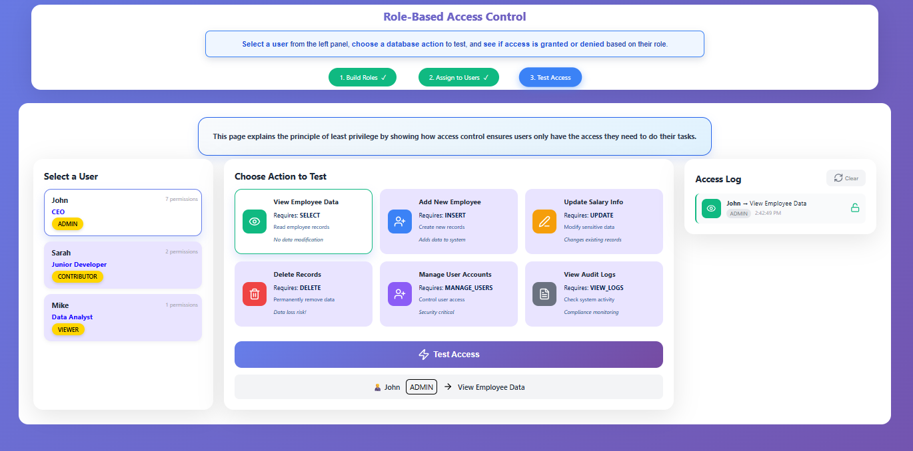
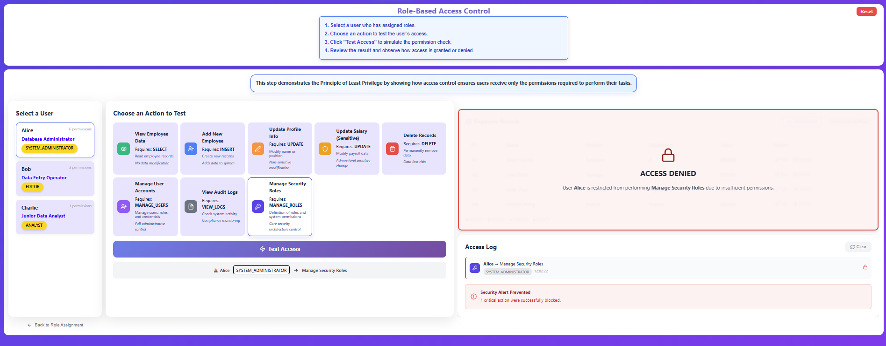
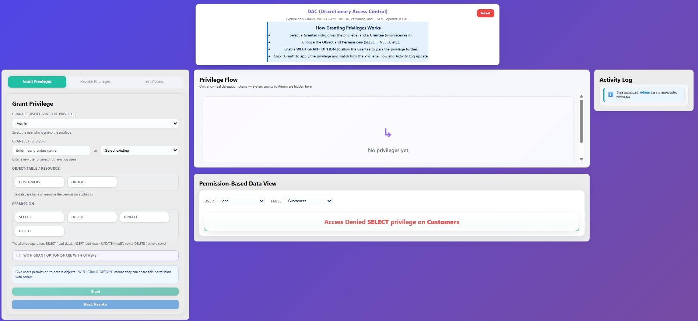
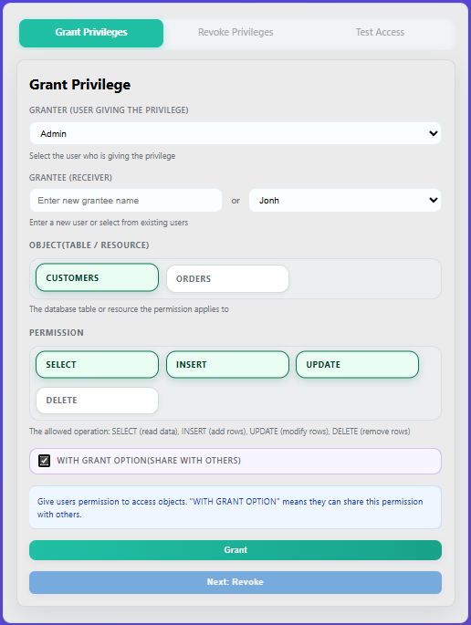
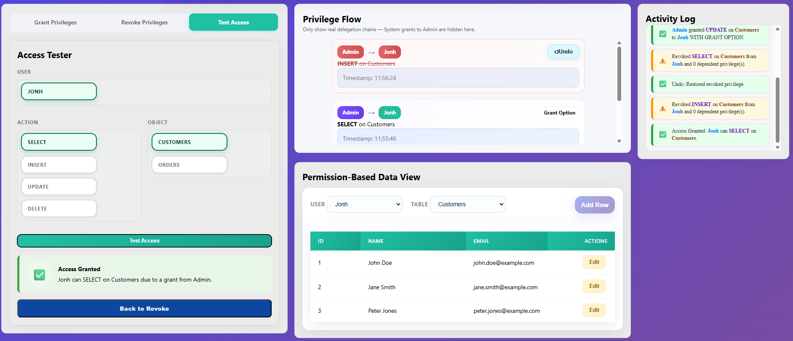
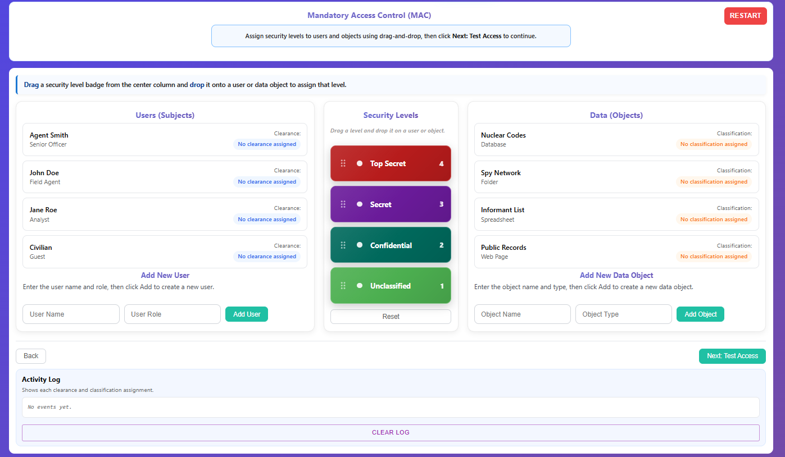

####  Role-Based Access Control (RBAC)
#####  Step 1 — Build Roles

- Read the instructions at the top and **drag and drop** the correct permissions into each role.  
  

- Click **Assign Permissions to Roles** to validate your setup.  
  A green **Assigned** status indicates a successful configuration.  
- Then click **Next: Assign Roles to Users** to continue.  
  

#####  Step 2 — Assign Roles to Users

- Assign the available roles to users based on their **positions and responsibilities**.  
  

- Click **Verify User Roles** to confirm your assignments, then select **Next: Testing Phase** to proceed.  
  

#####  Step 3 — Test & Verify Privileges

- In the Testing Phase, **select a user** from the left panel, choose an **action**, and test whether that user has access to perform it.  
  

- Click **Test Access** and observe the result:  
  -  **Access Granted** — The user’s role includes the required permission.  
  -  **Access Denied** — The user’s role does not include the required permission.  

- Review the **Access Log** for details such as the user, assigned role, action, and timestamp.  
  

####  Discretionary Access Control (DAC)

##### **Step 1 — Grant Privileges**

* Open the **Grant Privileges** tab.

* Select the **Granter** (user giving the privilege), typically **Admin**.
* Select the **Grantee** (user receiving the privilege).
* Choose the **Object** (table/resource such as *Customers* or *Orders*).
* Select the required **Permission** (*SELECT, INSERT, UPDATE, DELETE*).
* Enable **WITH GRANT OPTION** if the grantee is allowed to share the privilege.
* Click **Grant** to assign the privilege.

* The privilege assignment is reflected in the **Privilege Flow**, and the **Activity Log** is updated.

##### **Step 2 — Revoke Privileges**

* Navigate to the **Revoke Privileges** tab.
* Select the **User** whose privilege needs to be removed.
* Choose the **Object** associated with the privilege.
* Select the **Permission** to revoke.
* Click **Revoke (Cascade)** to remove the privilege.

 

* The privilege is revoked from the user, dependent privileges are removed, and the **Activity Log** is updated.

##### **Step 3 — Test & Verify Access**

* Open the **Test Access** tab.
* Select a **User** to test.
* Choose an **Action** (*SELECT, INSERT, UPDATE, DELETE*).
* Select the **Object** on which the action is tested.
* Click **Test Access**.

* Observe the result:

  * **Access Granted** — The user has the required privilege.
  * **Access Denied** — The user does not have the required privilege.
* The access result is recorded in the **Activity Log**.

  

#### Mandatory Access Control (MAC)

##### **Step 1 — Assign Security Levels**

* Read the instructions displayed at the top of the interface.
* Drag a **Security Level** from the center panel and drop it onto a **User (Subject)** to assign clearance.
* Drag a **Security Level** and drop it onto a **Data Object** to assign classification.
* Ensure each user and data object has an assigned security level.
* Click **Next: Test Access** to proceed.

##### **Step 2 — Verify Assigned Clearances and Classifications**

* Review the assigned **clearance levels** for all users.
* Review the assigned **classification levels** for all data objects.
* Confirm that the visual indicators reflect the correct security hierarchy.
* The **Activity Log** is updated to record each assignment.

##### **Step 3 — Test & Verify Access**

* Select a **User** from the *Select User (clearance)* panel.
* Select a **Data Object** from the *Select Object (classification)* panel.
* Choose an **Action Mode**:

  * **READ** (No Read Up)
  * **WRITE** (No Write Down)
  * **COMBINED**
* Click **Test Access** to evaluate the access request.

##### **Step 4 — View Access Decision**

* Observe the **Security Ladder Visualization** showing the relative positions of the user and data object.
* The system displays one of the following results:

  * **Access Granted** — The request satisfies MAC rules.
  * **Access Denied** — The request violates MAC rules.
* The access decision is recorded in the **Activity Log**.

