#### Role-Based Access Control (RBAC)

##### Step 1 — Build Roles

* Review the available permissions defined by the **Super Admin** to understand what actions they allow.
* Drag and drop permissions from the pool into the predefined role cards to build each role. (You can also create custom roles by entering a name and clicking **Add Role**).

  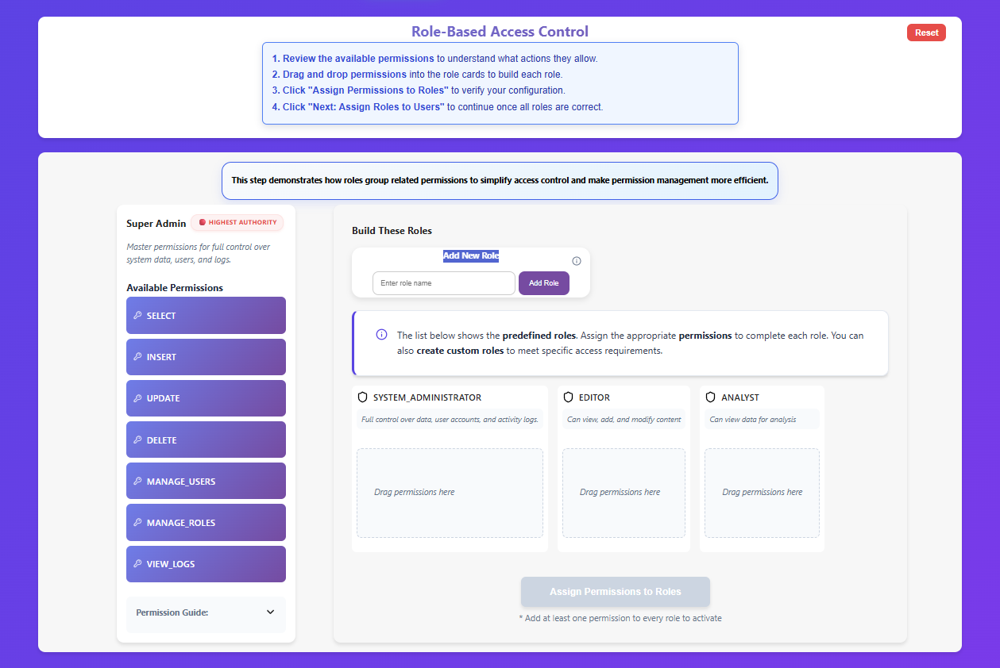

* Click "**Assign Permissions to Roles**" to verify your configuration. A green "Completed" status indicates success.

  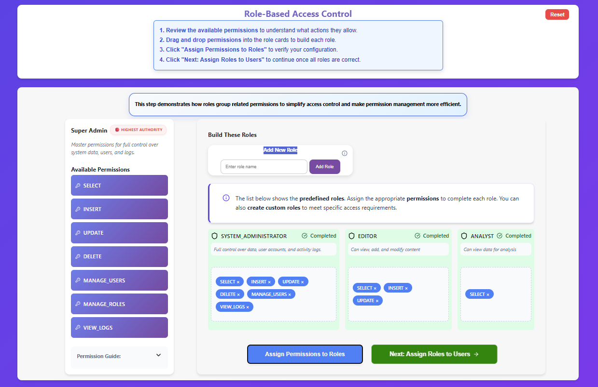
  
* Click "**Next: Assign Roles to Users**" to continue once all roles are correct.

##### Step 2 — Assign Roles to Users

* Review the users and their job responsibilities.
* Assign an appropriate role to each user using the dropdown menu. (You can also add a new user from the left panel).

  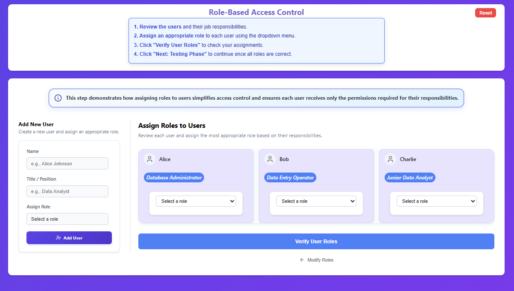

* Click "**Verify User Roles**" to check your assignments.

  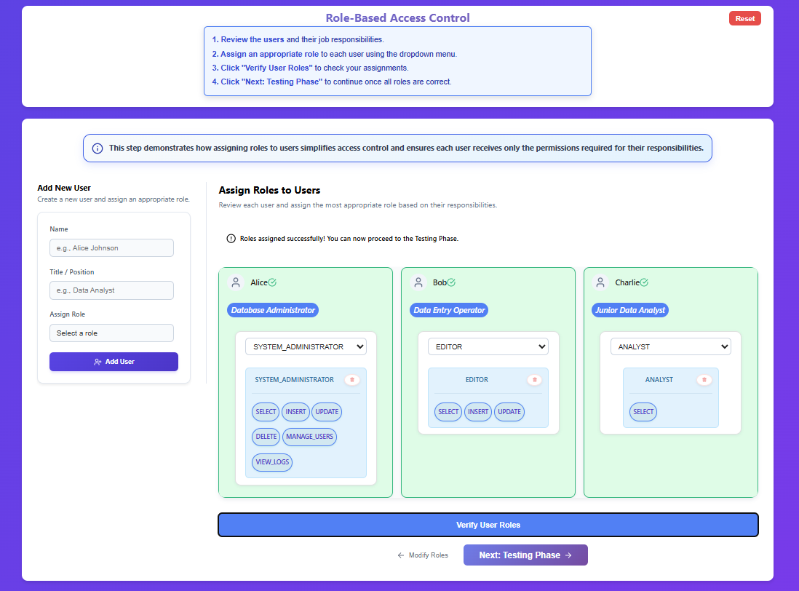

* Click "**Next: Testing Phase**" to continue once all roles are correct.

##### Step 3 — Test Access

* Select a user who has assigned roles.
* Choose an action from the grid to test the user's access against the **Employee Records** table.

  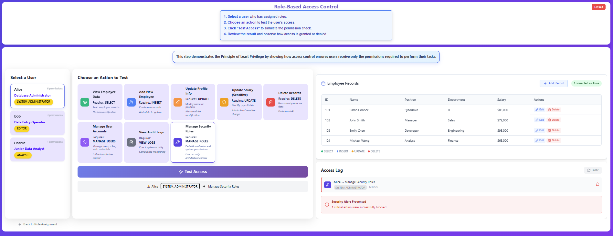

* Click "**Test Access**" to simulate the permission check.
* Review the result on the **Employee Records** preview panel (which will show 🔓 Access Granted or 🔒 Access Denied) and observe the action details recorded below in the **Access Log**.

  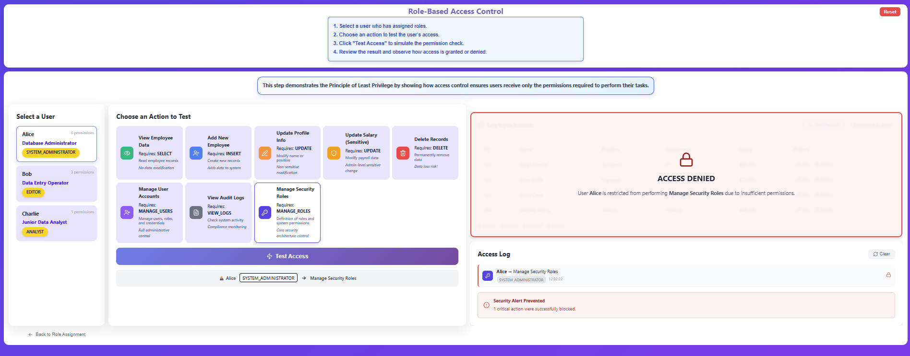

#### Discretionary Access Control (DAC)

##### Step 1 — Grant Privileges

* Open the **Grant Privileges** tab.

  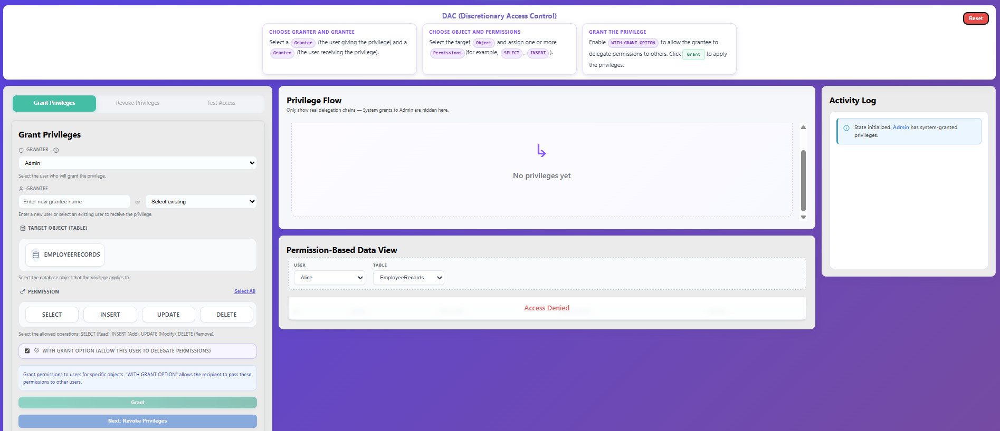
  
* Select a **Granter** (the user giving the privilege) and a **Grantee** (the user receiving the privilege).
* Select the target **Object** (e.g., Customers, Orders) and assign one or more **Permissions** (SELECT, INSERT, UPDATE).
* Enable **WITH GRANT OPTION** if you want the grantee to be able to delegate these permissions to others.
* Click **Grant** to apply the privileges.
* The privilege assignment will immediately reflect in the **Privilege Flow** mapping and the **Activity Log**.

  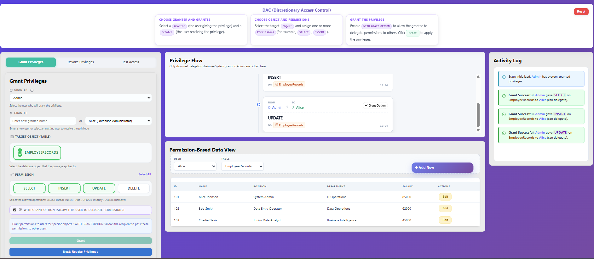

##### Step 2 — Revoke Privileges

* Navigate to the **Revoke Privileges** tab.
* Select the **User** whose privileges should be removed.
* Choose the **Object** and select one or more **Permissions** to remove.

  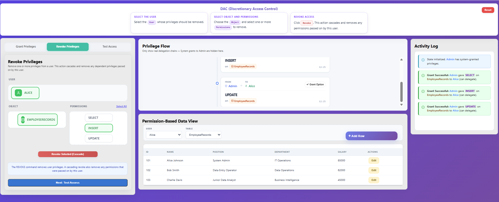
  
* Click **Revoke**. This action naturally cascades, automatically removing any permissions that were passed on by this user.
* Observe the changes in the **Privilege Flow** and **Activity Log**.

  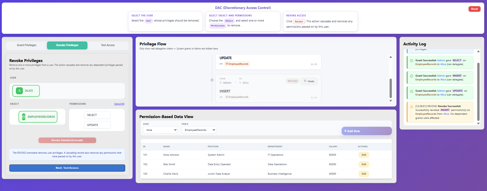

##### Step 3 — Test Access

* Open the **Test Access** tab.
* Select the **User** whose access you want to verify.
* Select the **Action** (permission) and the target **Object** to test.
* Click **Verify Access** to check whether the operation is authorized.

  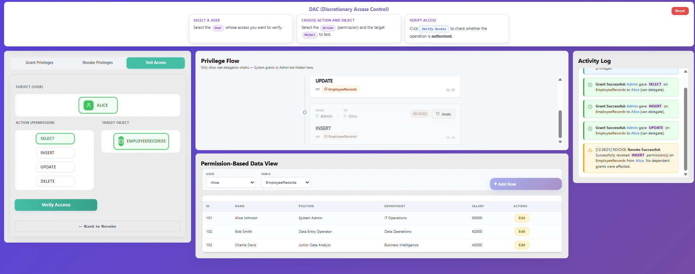

* Observe the result in the **Activity Log** (Access Granted or Access Denied).

  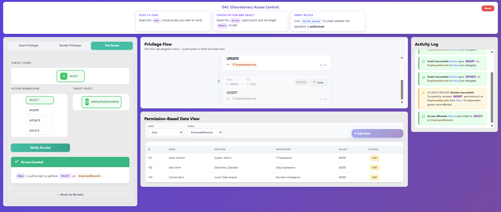

#### Mandatory Access Control (MAC)

##### Step 1 — Introduction to MAC

* Read the instructions explaining how Clearance and Classification work.
* Review the core rules of MAC based on the principle of dominance.

  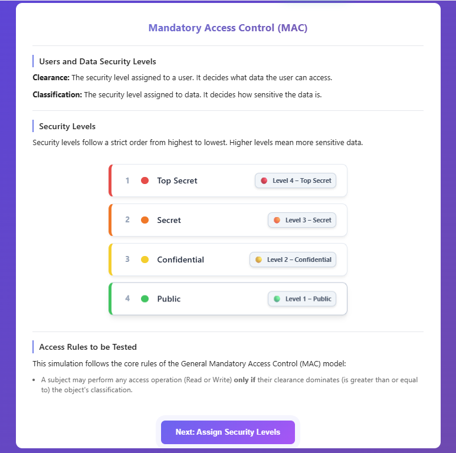
  
* Click **Next: Assign Security Levels** to enter the assignment view.

##### Step 2 — Assign Security Levels

* Drag a **Security Level** from the top palette and drop it onto a **User** card (to assign their Clearance).
* Drag a **Security Level** and drop it onto a **Data Object** card (to assign its Classification).

  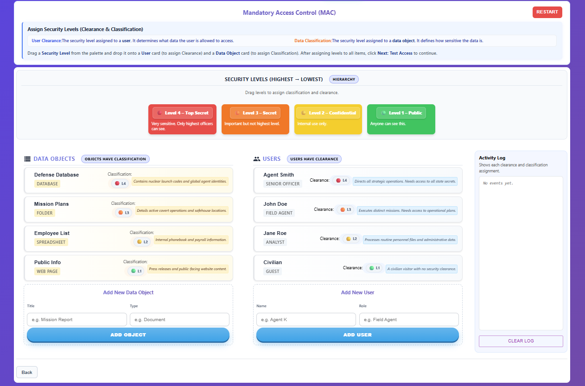
  
* Ensure every user and data object has an assigned security level.
  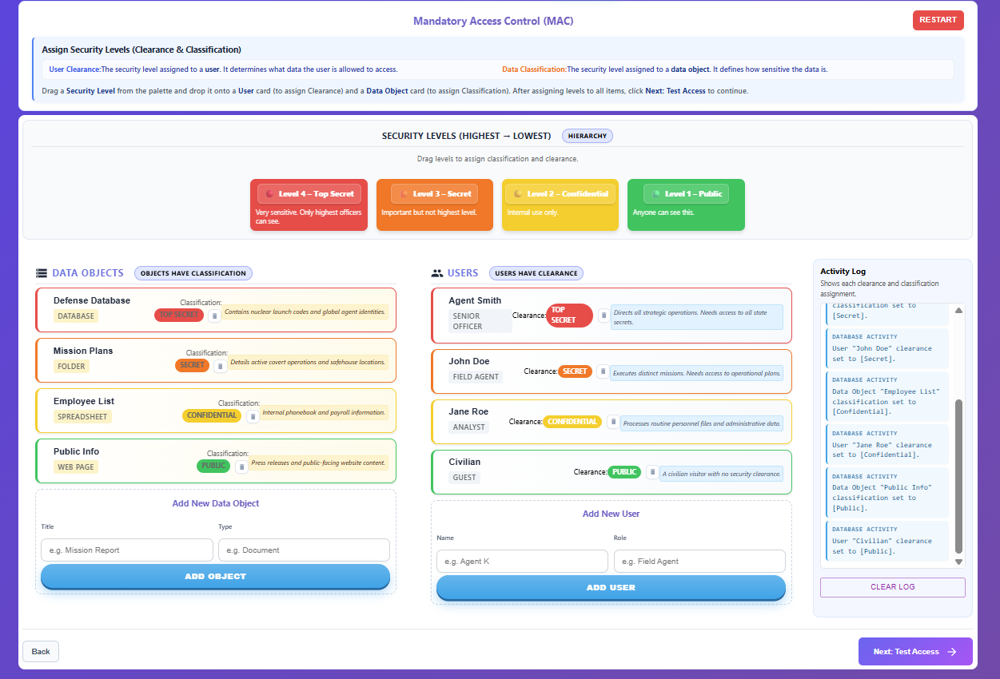
* Click **Next: Test Access** to proceed.

##### Step 3 — Test & Verify Access

* Select a **User** (Clearance) to act as the active subject.
* The **Secure Object Database** will update to display objects securely. If the selected user lacks sufficient clearance, sensitive object names and types are redacted (blurred out).
* Choose an Action mode (**Read** or **Write**) directly from the **Secure Object Database** table for a target **Data Object** (Classification) or select a combination from the top panels and click **Test Access**.

  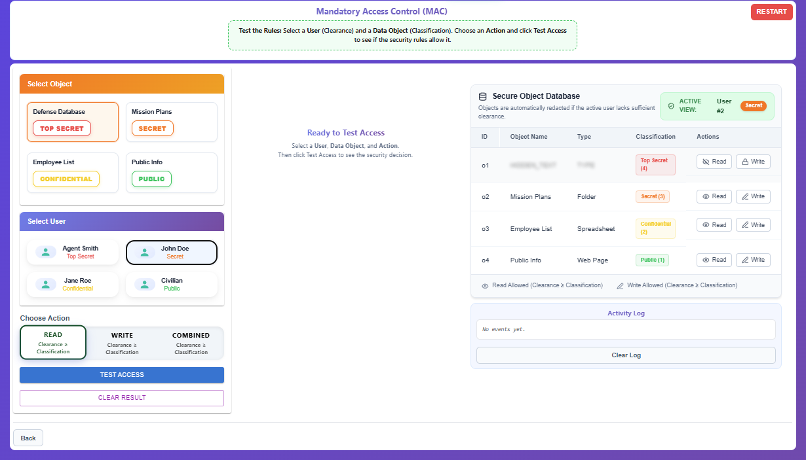

* The system will evaluate the **Access Decision**:
  * **Read/Write Allowed**: Requires Clearance ≥ Classification.
* Review the visual access decision (✅ ACCESS GRANTED or ⛔ ACCESS DENIED) and read the explanation.
* The decision history is recorded in the **Activity Log**.

  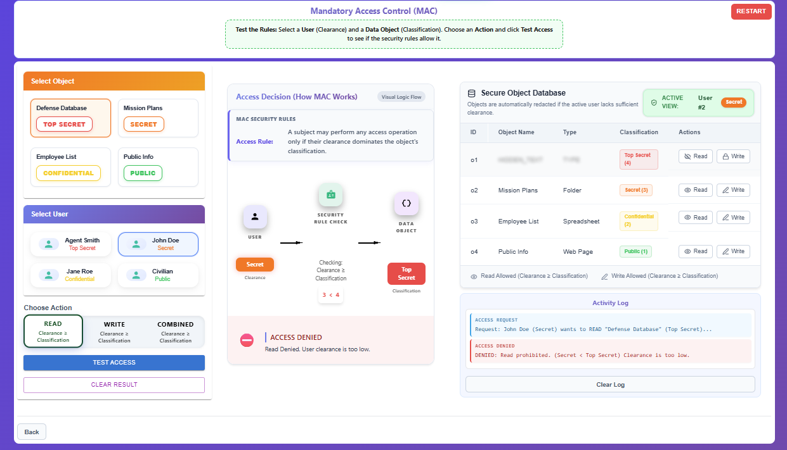
